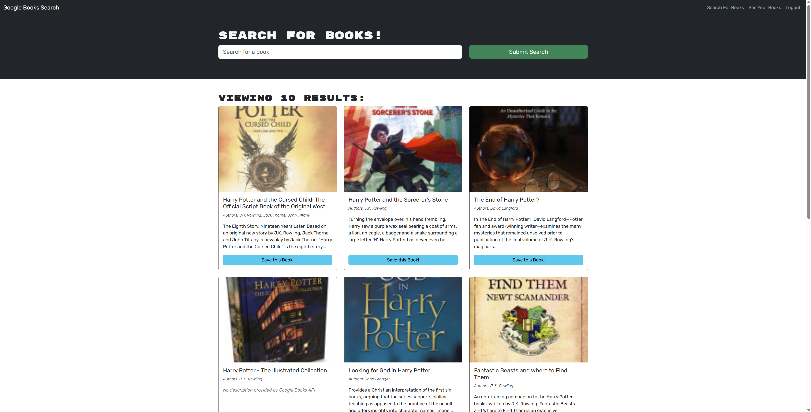
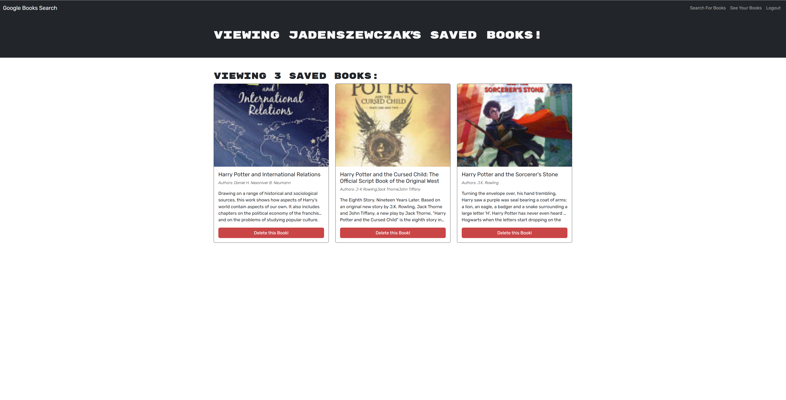

# Book Search Engine

## Description

A full-stack MERN application that allows users to search for books using the Google Books API and save their favorite books. This application was refactored from a RESTful API to a GraphQL API using Apollo Server and Apollo Client.

## Table of Contents

- [Installation](#installation)
- [Usage](#usage)
- [Features](#features)
- [Technologies](#technologies)
- [Screenshots](#screenshots)
- [Deployed Application](#deployed-application)
- [Contributing](#contributing)
- [Questions](#questions)
- [License](#license)

## Installation

1. Clone the repository

```bash
git clone https://github.com/jadenszewczak/book-search-engine.git
cd book-search-engine
```

2.Install dependencies

```bash
npm install
```

3.Create a `.env` file in the server directory

```bash
JWT_SECRET_KEY=your_secret_key_here
```

4.Start the development server

```bash
npm run develop
```

## Usage

1. Visit the application at `http://localhost:3000`
2. Search for books using the search bar
3. Create an account or login to save books
4. View your saved books in the "See Your Books" section
5. Remove books from your saved list as needed

## Features

- Search for books using Google Books API
- User authentication with JWT
- Save and remove books from personal library
- Responsive design for mobile and desktop
- GraphQL API with Apollo Server
- React frontend with Apollo Client

## Technologies

### Frontend

- React
- Apollo Client
- React Router
- React Bootstrap
- TypeScript
- Vite

### Backend

- Node.js
- Express.js
- Apollo Server
- GraphQL
- MongoDB/Mongoose
- JWT Authentication
- TypeScript

## Screenshots




## Deployed Application

[Live Demo on Render](https://book-search-engine-btij.onrender.com)

## Contributing

Contributions are welcome! Please feel free to submit a Pull Request.

## Questions

If you have any questions about this project, please contact me:

- GitHub: [jadenszewczak](https://github.com/jadenszewczak)
- Email: [jaden.szewczak@wakefern.com](mailto:jaden.szewczak@wakefern.com)

## License

This project is licensed under the MIT License.
